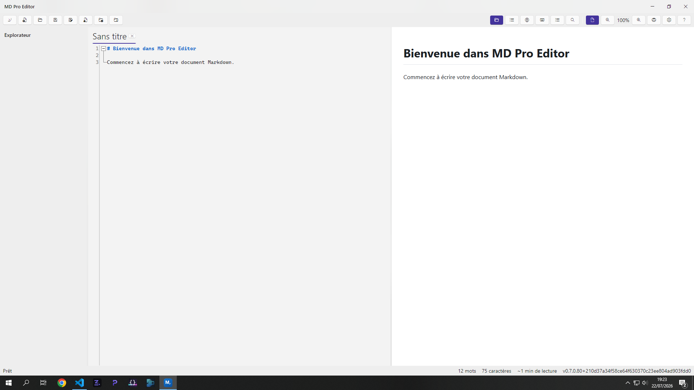

# MD Pro Editor

> L'éditeur Markdown le plus puissant, le plus beau et le plus complet au monde.

**Plateformes** : Windows 10 LTSC · Windows 10 · Windows 11
**Version actuelle** : 0.8.0

---

## À propos

MD Pro Editor est un éditeur Markdown natif Windows conçu pour surpasser Typora, Obsidian,
Mark Text, Zettlr, iA Writer et Ghostwriter sur trois axes :

- **Performance** — rendu instantané, même sur des documents volumineux.
- **UI/UX** — design Fluent 2 natif Windows 11 (Mica, barre de titre personnalisée, animations fluides).
- **Fonctionnalités** — CommonMark + GFM + extensions, organisation de notes façon Obsidian
  (liens wiki, rétroliens), exports multi-formats, sans jamais sacrifier la simplicité d'usage.

Le projet suit une feuille de route par phases (voir [ROADMAP.md](ROADMAP.md) pour le détail complet).

## Fonctionnalités

**Édition**
- Éditeur AvaloniaEdit avec coloration syntaxique Markdown complète, pliage de code, indentation
  intelligente des listes, auto-fermeture des paires, recherche & remplacement (regex)
- Multi-onglets, sauvegarde automatique, historique de versions locales
- Barre d'outils contextuelle flottante à la sélection (gras, italique, lien, surlignage)
- Command Palette (Ctrl+Maj+P), raccourcis clavier personnalisables

**Aperçu & rendu**
- Aperçu HTML en temps réel (Markdig : tables, tâches, footnotes, frontmatter, emoji)
- Formules mathématiques (KaTeX), diagrammes (Mermaid), coloration de code (Prism.js)
- Thèmes de preview (Clair / Sépia / Sombre) et CSS personnalisé
- Modes Focus (atténuation du texte hors paragraphe courant) et Machine à écrire

**Organisation**
- Gestion de workspace façon Obsidian : liens wiki `[[Nom]]` avec autocomplétion,
  panneau de rétroliens, création de notes à la volée
- Explorateur de fichiers, sommaire (TOC) navigable, recherche globale multi-fichiers
- Gestion d'images (collage, glisser-déposer, redimensionnement dans l'aperçu)
- Templates et snippets réutilisables, éditeur de frontmatter YAML

**Exports**
- HTML autonome, PDF, DOCX (Word natif via OpenXML), EPUB

**Licence & essai**
- Essai gratuit de 7 jours, 100 % fonctionnel, sans limitation

## Téléchargement

Les binaires sont publiés sur la page [Releases](https://github.com/Patrickjaillet/MD-Pro-Editor/releases)
du dépôt. Téléchargez le dernier installeur `MDProEditor-Setup-x.x.x.exe` et exécutez-le.

## Licence et achat

MD Pro Editor est un logiciel **shareware** :

- Version complète à 100 % pendant **7 jours d'essai**, sans limitation fonctionnelle.
- Déblocage définitif via l'achat d'une licence (**2,99 €** via [PayPal](https://paypal.me/ap3demak/2.99EUR)),
  livrée par code de licence après paiement.
- Code de licence perdu ou non reçu ? Contactez [contact.shaderstudio@gmail.com](mailto:contact.shaderstudio@gmail.com).

Voir [LICENSE.txt](LICENSE.txt) pour le contrat de licence utilisateur final complet.

## Copyright

**MD Pro Editor**
Copyright © 2026 Patrick JAILLET — Tous droits réservés
Email : [contact.shaderstudio@gmail.com](mailto:contact.shaderstudio@gmail.com)
Site web : [https://patrickjaillet.github.io/sandefjord-software](https://patrickjaillet.github.io/sandefjord-software)
